# Lab5web
untuk memenuhi tugas pemograman web 

Nama        : Anini permatasari 
NIM         : 312010095 
Kelas       : TI.20.B1 

pratikum 5 
## Langkah pertama kita bikin source code htmlnya seperti dibawah ini: 
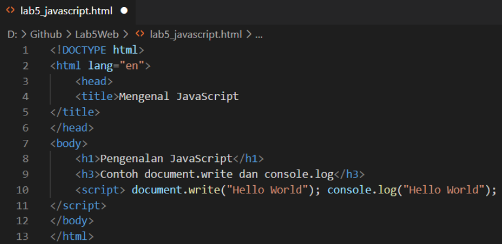 
kita lihat hasilnya : 
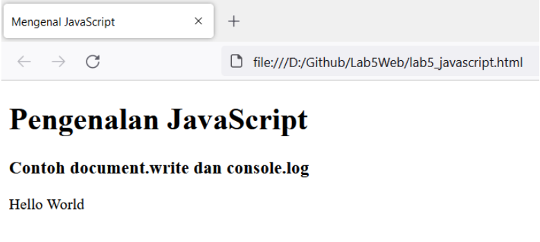 

## 1. Javascript Dasar 
berikut kita buat htmlnya dulu seperti dibawah ini: 
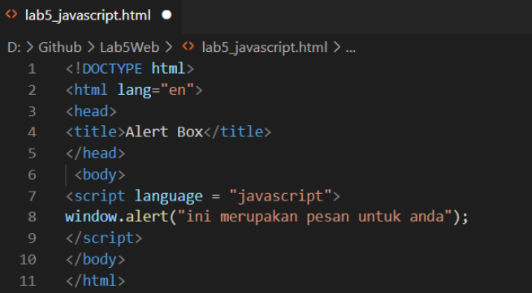 
kita lihat hasilnya :  
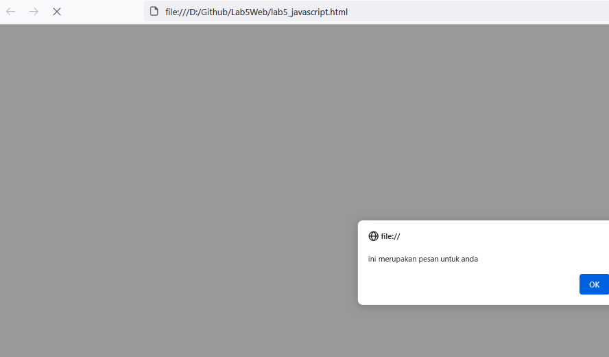 

## 2. Dasar Pemograman di Javascript
berikut kita buat htmlnya dulu seperti dibawah ini: 
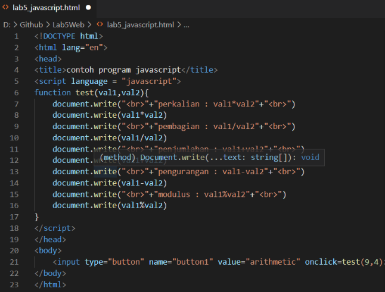 
kita lihat hasilnya : 
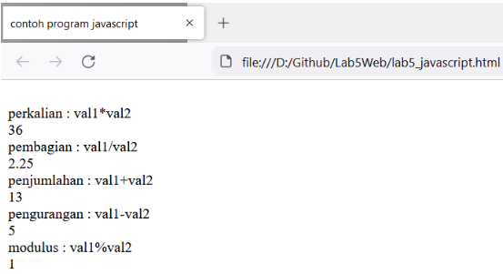 

## 3. Pembuatan Form
berikut kita  buat htmlnya dulu seperti dibawah ini: 
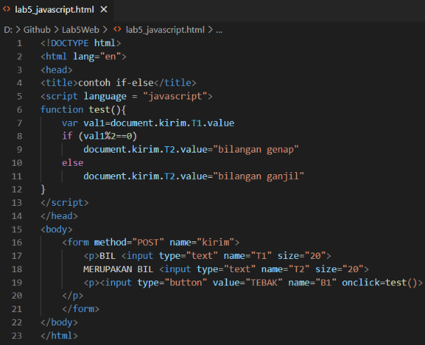 
kita lihat hasilnya : 
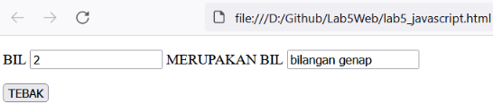 
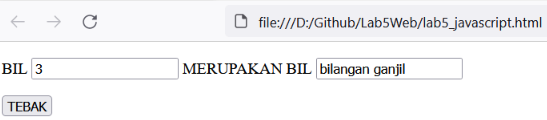 
Selanjutnya kita akan membuat htmlnya form button seperti dibawah ini: 
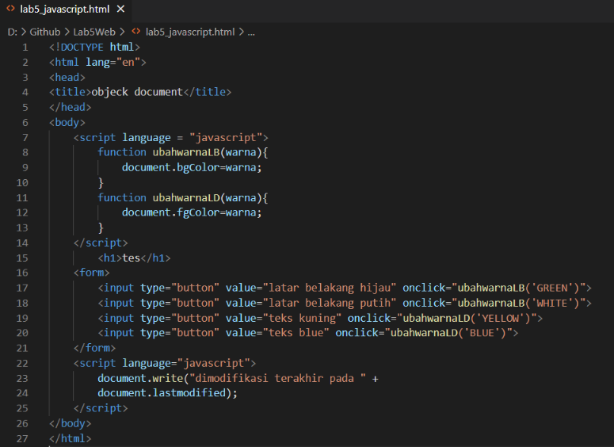 
kita lihat hasilnya : 
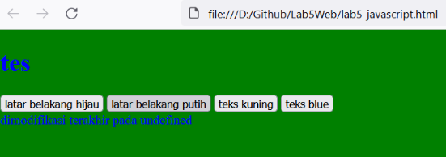 

## Pertanyaan dan Tugas
 
## Jawaban :
Berikut adalah Htmlnya  
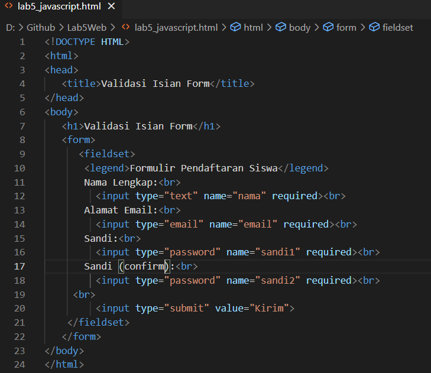 
Kita Lihat hasilnya : 
 

Sekian Dari saya, Kurang Lebih nya mohon dimaafkan. 
Terimakasih...... 

